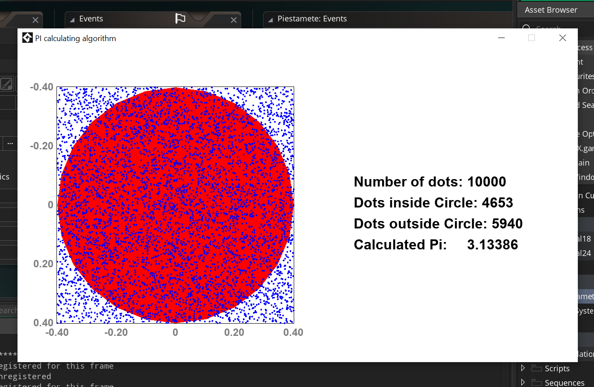

# Pi Estimation Algorithm
The algorithm for computing pi in gamemaker.

## Overview

This code uses a Monte Carlo simulation to estimate the value of Pi. The method is based on the idea that by randomly placing points within a square that encloses a circle, you can approximate Pi by comparing the ratio of points inside the circle to the total number of points.
 

## Theory Behind Pi Estimation

Pi can be estimated using random sampling within a known geometric shape, such as a square that contains a circle.

- The square has an area `A_square = side^2`.
- The circle inside the square has an area `A_circle = π r^2`, where `r` is the radius of the circle.

The ratio of the areas of the circle to the square is:
Ratio = (A_circle / A_square) = (π r^2 / 4r^2) = π / 4

By randomly placing points inside the square, the ratio of points that fall inside the circle to the total number of points will approximate the area ratio. Therefore, the value of Pi can be estimated as:
π ≈ 4 × (Number of points inside the circle / Total number of points)

## Code Explanation

### Create Event
The Create event initializes variables used in the simulation.

- **Rectangle & Circle Setup**: A square of size `540 x 540` and a circle with a radius of `270` (half the square's size) are drawn.
- **Dots**: The total number of dots to be generated (`numberofDots = 10000`) is set.
- **Pi**: `estimatedPI` is the variable where the calculated value of Pi will be stored.
- **Graphics Data**: Various font and positional settings for displaying text and data on the screen are initialized.

### Step Event
This is the heart of the simulation, where dots are randomly placed inside the square, and the estimation of Pi is calculated.

1. **Random Dot Creation**: Each dot is placed at a random `(x, y)` position within the square using the `random()` function.

2. **Dot inside the Circle Check**: The `point_distance()` function is used to check if the randomly generated point lies inside the circle. If the distance between the dot and the center of the circle is less than or equal to the radius of the circle, it is considered to be inside.

3. **Pi Estimation**: After checking whether the point is inside the circle, the algorithm estimates Pi using the formula:
estimatedPI = 4 × (number of dots in the circle / current number of generated dots)

This gives an increasingly accurate approximation as more dots are added.

4. **Increment Counter**: The index `dotindex` is incremented with each new dot, repeating the process until the total number of dots is reached.

### Draw Event
The Draw event handles the rendering of the visual elements on the screen.

1. **Draw the Square**: The square is drawn using `draw_rectangle_color()`.

2. **Draw the Circle**: The circle, which fits inside the square, is drawn using `draw_circle_color()`.

3. **Draw Dots**: All previously generated dots are drawn on the screen, with their color indicating their position.

4. **Display Data**: Information such as the total number of dots, the number of dots inside the circle, and the current estimate of Pi is drawn on the screen. The value of Pi is formatted to five decimal places for display.

## Conclusion

This code effectively demonstrates a Monte Carlo approach to estimating Pi. By simulating a large number of random points, the algorithm approaches the true value of Pi with increasing accuracy as more dots are generated and checked against the circle.

